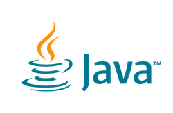

# A simple Java Spring Boot with Thymeleaf templates that can be used for testing in various Cloud Platforms like Azure, AWS, Heroku, and Google Cloud. See the following directions for deploying a Java Spring Boot application as a JAR with embedded server to Azure, Heroku, AWS, and Google Cloud. NOTE: if you are using JSP's (which are not recommended by Spring) then you should build and deploy a WAR file.

<p align="center">
 
</p>

## Functionality
* Spring Boot
* Spring MVC
* Spring Core
* Spring JDBC with MySQL
* Thymeleaf and Layouts
* Jasypt encrytion of database username and password properties 
	- NOTE: set an environment variable JASYPT_ENCRYPTOR_PASSWORD to your secret key 
* Deployment to Azure, Heroku, AWS, and Google Cloud

## Building and Testing
1. Run maven from Spring Tools Suite or Eclipse to build the project. The build artifacts will be stored in the `target/` directory.
2. Set the Java version to 15 for Heroku or 11 for Azure, AWS, and Google in the POM file. Test the Java Spring App locally by using JAVA: Open a terminal and navigate to the root of your project. Run the following command from the terminal window: java -jar target/*.jar
3. Goto localhost:8080/ OR localhost:8080/hello/test2 OR localhost:8080/[APP_NAME]/hello/test to validate the web app

## Important Fies
* .github/workflows - build scripts for Azure GitHub build pipeline
* Procfile - start file for Heroku
* web.config - start file for Azure
* app.yaml - start file for Google App Engine
* 
## Deployment to Cloud Platform Instructions
## Heroku:
1) Add a file named Procfile to the root of the project:
    - java -Dserver.port=$PORT $JAVA_OPTS -jar target/*.jar or java -Dserver.port=$PORT $JAVA_OPTS -war
    - NOTE: although not tested this file may now be optional on Heroku for Spring Boot
2) If desired you can set the web application context to something other than root at / by adding the following to the application.properties file:
    - server.servlet.context-path=/[APP_NAME]
3) Do a manual Maven build to ensure that everything builds properly. Make sure to include the resources and webapp in the output file of you are using JSP's:
4) Test the Maven build by opening a terminal window, navigate toe project diretory and running the following command:
5) Goto localhost:8080/ OR localhost:8080/hello/test2 OR localhost:8080/[APP_NAME]/hello/test
6) For Heroku if you are using a version greater than Java 8 you will need to add a file named system.properties to the root of your project with the following setting:
    - java.runtime.version=[VERSION OF JAVA]
7) Setup Heroku:
	- Create a new project and use GitHub deployment.
	- Add the JawsDB MySQL database. Update the database configuration in the Spring Boot application.properties files.
		- NOTE: although not tested it is possible this step is optional on Heroku for Spring Boot
	- If you are encrypting properties values then you will need to set a secret named JASYPT_ENCRYPTOR_PASSWORD with your Jasper encryption secret key
	- Click the Deploy tab. Click the Manual Deploy button to manually do a build. Click the Enable Automatic Deploys to enable the CI/CD build pipeline.
	- Open the app. 
	- If your app did not start then use the Heroku CLI and run the following commands:
		- heroku login
		- heroku ps:scale web=1 -a [APP_NAME]
	- Test by going to [HEROKU_URL]/hello/test2

The following steps can be followed to deploy a Spring Boot application to a Docker Container in Heroku:
1) Create an application in Heroku either using the CLI or the Web Interface. The application shown in this example is named playspringboot-mkr.
3) Build a Docker Image either thru the Maven Build Plugin Jib or via a Dockerfile. The image should be built from the openjdk:8-jdk-alpine base image, contain your application in a file named app.jar, expose port 8080, and also set the server.port variable to $PORT in the java startup command. The Docker Image shown in this example is named markreha/playspringboot:1.0.0.<br><br>
FROM openjdk:8-jdk-alpine<br>
COPY target/playapplication.jar app.jar<br>
EXPOSE 8080<br>
CMD [ "sh", "-c", "java -jar $JAVA_OPTS -Xmx300m -Xss512k -Dserver.port=$PORT /app.jar" ]<br><br>
	- docker build -t markreha/playspringboot:1.0.0 .
4) Run the Docker Image to make sure it works without error.
	- docker run -p8090:8080 -it markreha/playspringboot:1.0.0
5) Using the Heroku CLI, log into Heroku, tag and push the built Docker Image to the Heroku Docker Repository, release the Docker Image to your application, and open your application in Heroku
	- heroku container:login
	- docker tag markreha/playspringboot:1.0.0 registry.heroku.com/playspringboot-mkr/web
	- docker push registry.heroku.com/playspringboot-mkr/web
	- heroku container:release web -a playspringboot-mkr
	- heroku open -a playspringboot-mkr

## Azure:
1) Setup Azure:
	- From Marketplace find Web App from Microsoft click the Create link
	- Select Java 11 and the Tomcat 8.5 Java web server stack and for Windows
	- Proceed with defaults and click the Create button.
	- When deployment is finished, pin to your Dashboard, click the Go to resource button.
	- Run your app.
	- Under MySQL In Aop, enable the database, click the Save button, run your app, then go back to MySQL in App and click the Manage link to display phpMyAdmin MySQL Client, create database and initialize schema using DDL script.
	- Go to Advanced Tools to get DB credentials and configure your app.
	- Update the JDBC string in application.properties with the MySQL Port and make sure to add the parameter ?serverTimezone=UTF 
	- Set the Java version to 11 in the POM.xml and do a Maven build. Rename the output jar to app.jar.
	- Go to Advanced Tools, navigate to site/wwwroot, delete all existing content, and drag and drop a zip file containing the web.config (see example below) and app.jar to the page.
 ```xml
<?xml version="1.0" encoding="UTF-8"?>
<configuration>
    <system.webServer>
        <handlers>
            <add name="httpPlatformHandler" path="*" verb="*" modules="httpPlatformHandler" resourceType="Unspecified"/>
        </handlers>
        <httpPlatform processPath="%JAVA_HOME%\bin\java.exe"
                      arguments="-Djava.net.preferIPv4Stack=true -Dserver.port=%HTTP_PLATFORM_PORT% -jar &quot;%HOME%\site\wwwroot\app.jar&quot;">
        </httpPlatform>
    </system.webServer>
</configuration>
 ```
	- Go to Overview in azure and restart the app.
	- Click on the app link in the Azure Overview page (it make take a few minutes until app is restarted and running).

## AWS:
1) Go to All Services and under Compute click on the Elastic Beanstalk option or type elastic beanstalk in the search bar. Once you see Elastic Beanstalk click on that option.
2) Select Applications from the left pane. Click on the 'Create a new Application' button. Complete the following steps:
	- Give the Application a name and click the Create button.
	- Click on the 'Creat a new environment' button.
	- Select the 'Web server environment' option. Click the Select button.
	- Under the 'Platform' section select the Java platform option and the Coretto 11 option.
	- Under the 'Application code' section Select the 'Sample application' option.
	- Click the 'Configure more options' button.
	- Under the 'Database' section click the Edit button.
	- Select the mysql, the version of MySQL that you have built your application with, and the db.t2.micro options. Set the username and password for MySQL. Click the Save button.
	- Click the 'Create environment' button. 
	- It will take quite a few minutes before your application is ready. From the left pane click the Environments link and wait until the Health of your environments shows as OK.
	- From the left pane under your environment name click the Configuration link. Under the Database configuration click the link to URL of your database. This will open the RDS service. Click on your DB under the DB identifier column.
		- IMPORTANT: Under the 'Connectivity & security' section make sure the Public Accessibility setting is set to Yes. 
		- IMPORTANT: Under the 'Security group rules' section click on the 'EC2 Security Group - Inbound' security group. Under the 'Inbound rules' tab click the 'Edit inbound rules' button. Click the 'Add rule" button. Add add a rule for 'All TCP with a source type of 'Anywhere-IPv4' set to 0.0.0.0/0, and click the 'Save Rule' button.
		- IMPORTANT: Note the database Endpoint and Port under Connectivity" & security' section as this will be your database hostname and port for connecting to your database.
		- Using MySQL Workbench setup a connection using the AWS Database Endpoint URI and credentials. Create the schema and tables by running the DDL script created from your development environment.				
	- Configure and do a Maven build using the version of Java 11 for a JAR application. 	
		- NOTE: Elastic BeanStalk’s load balancer uses path “/” by default for health checks. If you don’t have that path defined in your controller, your application will keep failing health checks and will show Severe as status in dashboard. You can either have “/” endpoint in your controller or edit the load balancer setting later to use different path instead.
	- From the left pane under your environment name click the Configuration link. Under the Softare section click the Edit button. Under the 'Environment properties' add the following variable:
		- SERVER_PORT with a value of 5000. Click the Apply button. Wait for the changes to be deployed.
	- From the left pane click the Environments link. Click the link for your application environment. Click the 'Upload and deploy' button. Upload the application JAR file. Click the Deploy button. Wait for the changes to be deployed.
	- From the left pane click the click the Environments link. Click the application URL to access your application. 		

## Google App Engine:
1) Create an account on Google Cloud.
2) Create a new App Engine application of type Java using the following steps:
	- Select App Engine from the Main Menu.
	- Click the ‘Select a Project’ dropdown list and then click the New Project icon.
	- Give your Project a Name and click the Create button.
	- From the Welcome to App Engine screen click the Create Application button.
	- Select a Region from the US and click the Next button.
	- Select Java from Language list and a Standard Environment. Click the Next button. => This option was not available
3) Create a new MySQL Database using the following steps:
	- Select SQL menu item from the Main Menu. Click the Create Instance button.
	- Click the Choose MySQL button. If prompted click the Enable API button.
	- Fill out the Instance ID (database name), root password, desired version of MySQL, region, and single zone options.
	- Expand the Show Configuration Options. Select the Machine Type of Shared Core with 1vCPU and .614GB. Make sure Public IP is enabled. Click the Create Instance button. NOTE: it is extremely important that these options are set to avoid being charged by Google for your database usage.
	- The database instance can take quite a few minutes to complete.
	- Note your Public IP Address.
	- From the left pane select the Users menu, click the Add User Account button, and then create a new user [DB_USERNAME]/[DB_PASSWORD] with the Allow any host option. Click the Add button.
	- Select the Database menu, enter your new Database (your schema) name and click the Create button.
	- Get your public IP Address by going to your browser and in the search bar enter ‘My IP’. Note your IPv4 Address for the next step.
	- Select the Connections menu and under Authorization Networks click Add Network button, name of GCU, network of your IP Address (from previous step), click Done and Save buttons.
	- The database updates can take quite a few minutes to complete.
	- Setup a MySQL Workbench connection using the databases IP address (listed in the Overview menu) and your database credentials (setup from the prior step).
	- Connect to the database in MySQL Workbench and run your DDL script.
	- From the main Google menu go to APIs & Services, click on the Library menu, search for Google Cloud SQL, click on each one, and make sure both Cloud SQL and Cloud SQL Admin API are enabled.
4) Configure, build, test, and deploy the Spring Boot test application using the following steps:
	- Open up a Cloud Shell from the Activate Cloud Shell icon in the top menu. From the Cloud Shell, create a working directory, change into that working directory, and perform the following operations. 
		• NOTE: once you have a Cloud Shell open if you click on the Pencil icon from the Cloud Shell menu this will open a tree view of your code, which allows you to edit some of your configuration files. Once you are in the editor you can also upload files into your project.
	- Run the following command from the Cloud Shell:
		• git clone [URL to your Test App Repo]
	- Click the Open Editor button and make the following changes to the application:
		• Update the POM file with the following changes:
			- Set Java to version 11:
```xml
	<properties>
 		<java.version>11</java.version>
	</properties>
 ```
 
			- Add the following dependencies:
```xml
        <!-- For Google App Engine -->
        <dependency>
   	        <groupId>com.google.cloud.sql</groupId>
   	        <artifactId>mysql-socket-factory</artifactId>
   	        <version>1.0.5</version>
        </dependency>
        <dependency>
   	        <groupId>com.google.api-client</groupId>
   	        <artifactId>google-api-client</artifactId>
   	        <version>1.23.0</version>
        </dependency>
        <dependency>
   	        <groupId>com.google.api-client</groupId>
   	        <artifactId>google-api-client-appengine</artifactId>
   	        <version>1.21.0</version>
        </dependency>
        <dependency>
            <groupId>jakarta.xml.bind</groupId>
            <artifactId>jakarta.xml.bind-api</artifactId>
            </dependency>
        <dependency>
            <groupId>com.sun.xml.bind</groupId>
            <artifactId>jaxb-impl</artifactId>
            <version>2.3.3</version>
            <scope>runtime</scope>
        </dependency>		
```

			- Add the following plugins:
```xml
            <!-- For Google App Engine -->
            <plugin>
   	            <groupId>com.google.cloud.tools</groupId>
   	            <artifactId>appengine-maven-plugin</artifactId>
   	            <version>2.2.0</version>
                <configuration>
                    <version>1</version>
                    <projectId>GCLOUD_CONFIG</projectId>
                </configuration>
            </plugin>
```
		• Create a new directory named appengine under src/main. Create new file in src/main/appengine named app.yaml with the following entries:
```yaml
runtime: java11
handlers:
- url: /.*
  script: this field is required, but ignored
manual_scaling:
  instances: 1
```
		
		• Update application.properties file with the MySQL connection configuration as follows:
spring.datasource.url=jdbc:mysql://google/[SCHEMA]?socketFactory=com.google.cloud.sql.mysql.SocketFactory&amp;cloudSqlInstance=[PROJECT_NAME_ID]:[DB_REGION]:[DB_INSTANCE_NAME]

	d. Test locally in Cloud Shell by navigating to the root or you project and running the following commands:
		• mvn clean package
		• cd target
		• java -jar [JAR_NAME]
		• Make sure there are no errors at startup
		• Test by clicking on the Web Preview icon in the Shell and use port 8080 option
	3. Deploy in Cloud Shell by navigating to the root of you project and running the following command:
		• Deploy to App Engine: mvn package appengine:deploy
		• This will take a few minutes to complete
		• Test by going to https://[PROJECT_NAME].appspot.com/

